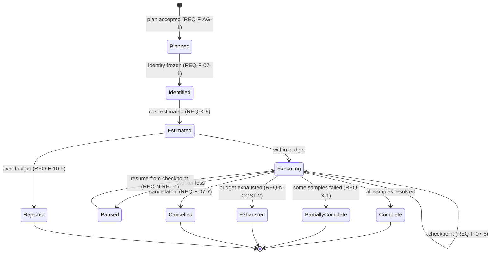
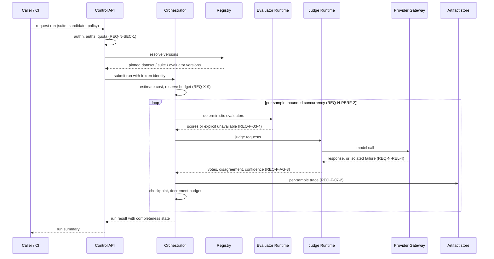
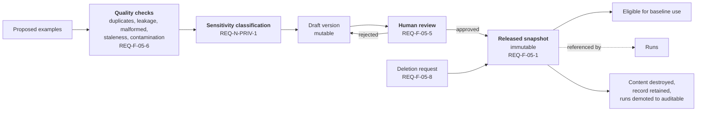
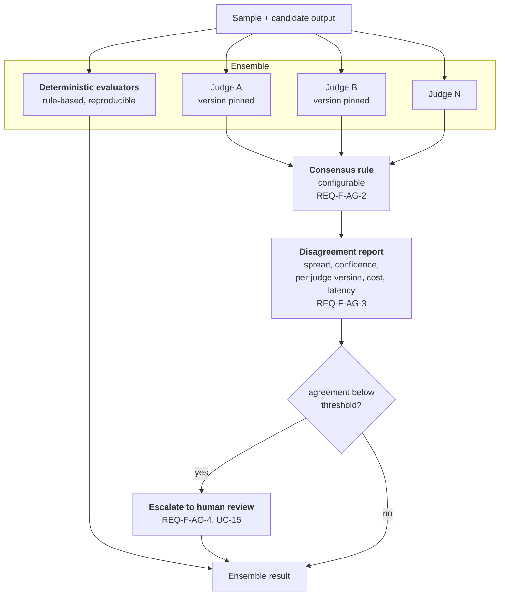
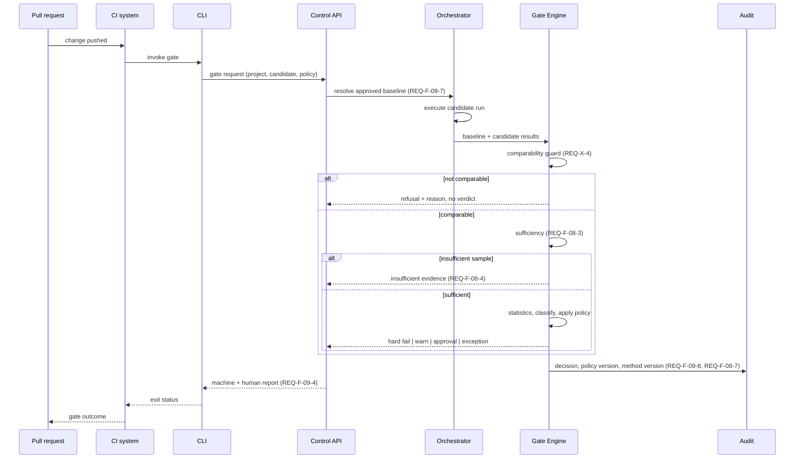

# Component Architectures

| Field | Value |
|---|---|
| Status | **Draft — pending external review** |
| Milestone | M2.2 — Component Architectures |
| Phase | Phase 2 — Architecture |
| Required by | Canonical §18 (harness, dataset, judge ensemble, gate flow), §9, §10, §11 |
| Depends on | [`system-architecture.md`](system-architecture.md) |
| Technology | Not decided here. See [`../adr/`](../adr/). |

Four component architectures, plus the data-flow and sequence views canonical §18 requires. The deterministic-versus-reasoning responsibility map is in [`system-architecture.md`](system-architecture.md) §4 rather than repeated here.

---

## 1. Evaluation Harness

`[CANON §9]` The harness is the execution core: it turns a plan into a run, and a run into results that a gate can trust.

### Run lifecycle

**Identity is frozen before execution begins.** `REQ-F-07-1` requires an immutable identity covering dataset version, prompt version, model and provider configuration, evaluator and judge versions, seeds, environment metadata, and timestamps. Freezing it first is what makes replay (`REQ-F-07-3`) able to state honestly what it could and could not reconstruct.

**Four terminal states are not "complete".** `Rejected`, `PartiallyComplete`, `Exhausted`, and `Cancelled` are distinct from `Complete`, and each propagates incompleteness to every aggregate derived from the run (`REQ-X-1`). Collapsing them into success-or-failure is the failure mode `REQ-X-2` exists to prevent: a partially complete run whose missing samples are read as zero scores.

### Execution sequence

### Properties the harness must guarantee

| Property | Requirement | How the architecture provides it |
|---|---|---|
| Reproducibility | `REQ-F-07-3` | Identity frozen pre-execution; cache reads recorded as cache reads (`REQ-F-07-4`) |
| Version pinning | `REQ-F-06-3` | The benchmark suite version is pinned into run identity, so a suite edit cannot retroactively change what a past run measured |
| Cache correctness | `REQ-F-07-4` | Cache key derived from the frozen identity; a cache hit cannot change an outcome, only its cost |
| Exactly-once effect | `REQ-N-REL-2` | Per-sample idempotency key from run identity plus sample identity |
| Survives worker loss | `REQ-N-REL-1` | Checkpoint after each resolved sample; resume recomputes nothing already resolved |
| Failure isolation | `REQ-F-02-6` | Provider Gateway scopes failure to one candidate; siblings continue and the affected candidate is marked incomplete |
| Budget enforcement | `REQ-X-9`, `REQ-N-COST-2` | Estimate then reserve; in-flight decrement; exhaustion is a defined terminal state, not an incident |
| Trajectory bounds | `REQ-F-04-5` | Ingest limit with explicit truncation marking |

**Deterministic and probabilistic results travel separately** from the moment they are produced (`REQ-F-08-6`). The orchestrator does not merge them into a single score column; the gate engine receives two distinct result shapes.

## 2. Golden Dataset

`[CANON §10]` The dataset component owns the artifacts a gate decision rests on, so its integrity requirements are stricter than the rest of the platform.

### Version lifecycle and data flow

| Stage | Rule |
|---|---|
| Quality checks precede review | `REQ-F-05-6` — a human reviewer should not be the first line of defence against a duplicate or a leaked test example |
| Schema enforced per version | `REQ-F-05-3` — violating examples rejected, not coerced |
| Approval gates baseline eligibility | `REQ-F-05-5` — an unapproved version cannot become a baseline |
| Released snapshots immutable | `REQ-F-05-1` — the only permitted mutation is erasure |
| Deletion blocked while referenced | `REQ-F-05-9` — an active baseline pins its dataset; override is explicit and audited |

### The erasure/immutability resolution

`REQ-F-05-8` and `REQ-F-05-1` conflict directly: released snapshots are immutable, and erasure must be enforceable. The architecture resolves it by **separating example content from example record**:

- The **record** — identity, schema position, labels, lineage — is immutable and survives erasure.
- The **content** — the text or payload — is separable and destructible.
- Runs referencing erased content are **demoted from reproducible to auditable**: the decision remains fully explainable and audited, but replay (`REQ-F-07-3`) will report that it cannot reconstruct the input.

This preserves both requirements at the cost of a documented, visible reduction in replay fidelity. That cost is stated rather than hidden: a reviewer must be able to see that a past decision is no longer replayable and why. Mechanism selection is [ADR-011](../adr/ADR-011-artifact-retention.md) and [ADR-005](../adr/ADR-005-dataset-immutability.md).

**Erasure reaches derived artifacts.** `REQ-N-PRIV-4` makes deletion incomplete if per-sample traces retain the content the dataset record no longer holds. Artifacts are therefore indexed by the example identity they derive from.

## 3. Judge Ensemble

`[CANON §8]` Canonical §25 forbids treating a single judge as ground truth. The ensemble exists to make disagreement visible, not to manufacture agreement.

| Rule | Requirement | Rationale |
|---|---|---|
| Judges are heterogeneous | `REQ-F-AG-2` | Identical judges produce correlated errors and a false impression of consensus |
| Deterministic evaluators never vote in the ensemble | `REQ-F-08-6` | They are not opinions; averaging them with judges destroys the distinction |
| Disagreement is an output, not diagnostics | `REQ-F-AG-3` | It must be able to block a release, which requires it to be a first-class result |
| Low agreement escalates | `REQ-F-AG-4` | Averaging away disagreement is precisely the canonical §25 anti-pattern |
| Judge version is part of run identity | `REQ-F-07-1`, `REQ-F-08-8` | A version change invalidates comparability rather than warning |
| Judge input is untrusted | `REQ-X-7`, `REQ-N-SEC-3` | Sample content reaches the judge through a legitimate path and is the primary injection vector |

**Escalation is a terminal outcome, not a retry.** When agreement is below threshold, the ensemble does not iterate until it agrees; it reports that it could not agree and routes to human review. Consensus strategy is [ADR-004](../adr/ADR-004-judge-ensemble.md).

## 4. CI/CD gate flow

`[CANON §11]` The gate is the product's primary interface to the outside world, and the surface where trust is won or lost.

### Outcome taxonomy

The CLI's exit status must distinguish outcomes that mean different things to a developer.

| Outcome | Meaning | Requirement |
|---|---|---|
| Pass | Candidate met policy against an approved baseline | `REQ-F-09-2` |
| Hard fail | Policy violated with sufficient evidence | `REQ-F-09-2` |
| Warning | Policy violated at warning severity | `REQ-F-09-2` |
| Approval required | Policy requires human authorisation | `REQ-F-09-2` |
| Exception applied | Policy waived with actor, justification, expiry, audit | `REQ-F-09-6` |
| Insufficient evidence | Sample below minimum; no quality claim made | `REQ-F-08-4` |
| Not comparable | Version drift invalidated the comparison | `REQ-X-4` |
| Platform failure | The platform failed; **no quality verdict** | `REQ-F-09-5`, `REQ-X-10` |

**The last one is the one that decides whether the product is trusted.** `REQ-X-10` and the note in `use-cases.md` both single it out: if a developer is told their change regressed quality when in fact the evaluation service was unavailable, they discount every subsequent verdict. Platform failure and quality failure must be distinguishable at a glance and by exit status, not merely in a log.

**Every outcome carries its evidence** (`REQ-F-09-4`, `REQ-X-8`), including the two refusal outcomes. The policy version and the statistical method version are recorded with the decision (`REQ-F-09-8`, `REQ-F-08-7`), so a past verdict can be re-derived under the rules that actually applied at the time.
