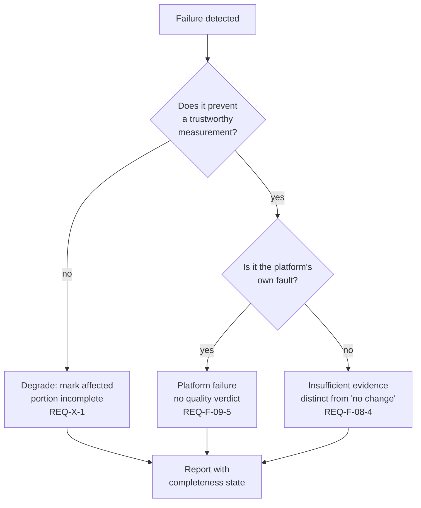

# Failure Model

| Field | Value |
|---|---|
| Status | **Draft — pending external review** |
| Milestone | M2.4 — Failure Model |
| Phase | Phase 2 — Architecture |
| Required by | Canonical §21 (failure modes to design for), §18 (failure/recovery views) |
| Depends on | [`system-architecture.md`](system-architecture.md), [`component-architectures.md`](component-architectures.md) |

Every failure mode canonical §21 names, with its detection, response, and recovery. The organising principle is stated first because it decides most of the individual entries.

## The governing rule

**A failure must never be expressible as a quality verdict.**

`REQ-X-10` and `REQ-F-09-5` require platform failure to be reported distinctly from quality failure. `REQ-X-2` forbids representing a failed or abstained evaluation as a score. Together these mean the platform has exactly three honest answers when something breaks: *the candidate regressed*, *I could not determine whether the candidate regressed*, or *I failed*. Collapsing the second or third into the first is the failure that destroys trust in every subsequent verdict.

## Failure modes

### Provider failures — canonical §21

| Mode | Detection | Response | Recovery | Requirement |
|---|---|---|---|---|
| Provider outage | Connection failure, sustained error rate at the Provider Gateway | Isolate to the affected candidate; siblings continue | Retry with backoff; mark candidate incomplete if unrecovered | `REQ-F-02-6`, `REQ-N-REL-4` |
| Rate limiting | Rate-limit response, or local limiter trip | Backoff and requeue; do not treat as candidate failure | Resume at reduced concurrency | `REQ-N-REL-4`, `REQ-N-PERF-2` |
| Malformed response | Schema validation failure at the gateway | Explicit unavailable result for that sample; never a zero | Bounded retry; then mark sample unresolved | `REQ-X-2`, `REQ-N-REL-4` |
| Model deprecation | Provider signal, or configuration resolution failure | Refuse to substitute a different model silently | Comparability invalidated; baseline must be re-scored | `REQ-X-4`, `REQ-F-08-8` |

**Silent model substitution is the dangerous one.** A provider retiring a model and routing to a successor would produce a valid-looking comparison between two different systems. `REQ-F-02-2` requires recording every output-affecting parameter precisely so this is detectable.

### Evaluation-integrity failures — canonical §21

| Mode | Detection | Response | Recovery | Requirement |
|---|---|---|---|---|
| Judge disagreement | Agreement measure below threshold | Return `escalated`; route to human review | Human adjudication; never retry to agreement | `REQ-F-AG-4` |
| Judge drift | Agreement and calibration trend over baseline history | Alert; flag affected baselines | Re-score baseline under current judge version | `REQ-F-11-4`, `REQ-F-08-8` |
| Evaluator crash | Process failure or timeout in the sandbox | Explicit unavailable; never a zero | Bounded retry; sample marked unresolved | `REQ-X-2`, `REQ-N-SEC-4` |
| Plugin incompatibility | Declared schema versus observed output mismatch | Reject the evaluator; do not record its output | Evaluator version pinned; incompatibility surfaced to owner | `REQ-F-AG-9` |
| Poisoned benchmark example | Dataset quality checks; injection detection at judge boundary | Quarantine example; block version approval | Human review before release | `REQ-F-05-6`, `REQ-N-SEC-3`, `REQ-X-7` |
| Stale baseline | Baseline age and version drift against current versions | Comparability invalidated rather than warned | Re-score or re-approve baseline | `REQ-X-4` |
| Changed evaluator version | Version comparison in the comparability guard | Refuse the comparison; state which element differs | Re-score baseline | `REQ-F-01-4`, `REQ-F-08-8` |

### Execution failures — canonical §21

| Mode | Detection | Response | Recovery | Requirement |
|---|---|---|---|---|
| Partial run failure | Unresolved samples at run completion | Terminal state `PartiallyComplete`; completeness propagates | Gate applies sufficiency check; may return insufficient evidence | `REQ-X-1`, `REQ-F-08-3` |
| Worker crash | Heartbeat or lease expiry | Work unit returns to the queue | Resume from last checkpoint; no completed sample recomputed | `REQ-N-REL-1`, `REQ-F-07-5` |
| Duplicate delivery | Idempotency key already resolved | Discard the duplicate effect | Exactly-once effect on results and cost | `REQ-N-REL-2` |
| Cancellation | Explicit request | Stop scheduling; settle in-flight work | Consistent, clearly incomplete record | `REQ-F-07-7` |

### Infrastructure failures — canonical §21

| Mode | Detection | Response | Recovery | Requirement |
|---|---|---|---|---|
| Metadata store transient failure | Connection or transaction failure | Fail closed; no verdict emitted from a degraded path | Retry; surface as platform failure if unrecovered | `REQ-N-REL-3`, `REQ-F-09-5` |
| Artifact store failure | Write or read failure | Sample marked unresolved; run may continue | Retry; run demoted to partially complete | `REQ-N-REL-3`, `REQ-X-1` |
| Coordination-store failure | Lock or counter operation failure | **Refuse to start new work** rather than proceed without budget enforcement | Resume when restored | `REQ-X-9`, `REQ-N-REL-3` |
| Audit write failure | Audit emission failure | Fail the governed action; do not complete it unaudited | Retry; the action stays incomplete until audited | `REQ-X-5`, `REQ-N-COMP-3` |

**Two entries here are deliberately strict.** A coordination-store failure stops new work because proceeding without budget enforcement would violate `REQ-X-9` invisibly and could spend without limit. An audit write failure fails the action, because an unaudited governed action is indistinguishable from a concealed one — `REQ-N-COMP-1` requires an auditor to be able to reconstruct who approved what, and a best-effort audit cannot support that.

### Cost failures — canonical §21

| Mode | Detection | Response | Recovery | Requirement |
|---|---|---|---|---|
| Budget exhaustion | In-flight counter reaches limit | Terminal state `Exhausted`; partial results marked incomplete | Explicit re-authorisation required | `REQ-N-COST-2`, `REQ-X-9` |
| Unexpectedly expensive plan | Pre-execution estimate exceeds budget | Reject before execution; do not partially execute | Plan revised or budget raised | `REQ-F-10-5`, `REQ-N-COST-3` |

### Evidence and isolation failures — canonical §21

| Mode | Detection | Response | Recovery | Requirement |
|---|---|---|---|---|
| Statistically inconclusive result | Interval wider than per-metric precision | Return **insufficient evidence** — never "no change" | Larger sample, or accept inconclusive | `REQ-F-08-4`, `REQ-X-3` |
| Sample below minimum | Sufficiency check before statistics | Decline to classify | Larger sample | `REQ-F-08-3` |
| Cross-tenant access attempt | Datastore enforcement rejection | Fail closed; emit audit event | Investigation; no data returned | `REQ-F-12-5`, `REQ-N-SEC-2` |

## Failure modes not in canonical §21, added from the requirement set

| Mode | Why it belongs | Response | Requirement |
|---|---|---|---|
| Erased content requested for replay | `REQ-F-05-8` makes this a normal consequence of honouring erasure, not an error | Replay reports partial reconstruction; run already marked auditable rather than reproducible | `REQ-F-07-3`, `REQ-F-05-8` |
| Missing intermediate state for a requested evaluator | `REQ-F-03-4` makes integration depth a caller variable | Evaluator reported unavailable; never approximated | `REQ-F-03-4` |
| Truncated agent trajectory | `REQ-F-04-5` bounds ingestion, so truncation is expected | Marked truncated; not evaluated as complete | `REQ-F-04-5` |

These three are worth stating because each looks like an error and is in fact a designed outcome. Treating them as errors would push the system toward the approximation `REQ-F-03-4` forbids.
