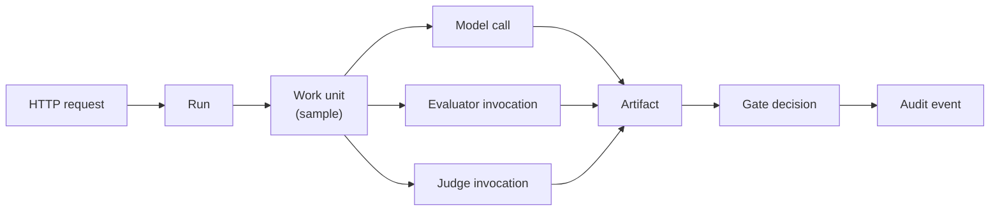

# Observability Strategy

| Field | Value |
|---|---|
| Status | **Implemented** — the design was accepted in Phase 2 and executed in Phase 13; §5 now carries measured targets and named blockers |
| Milestone | M2.6 — Observability Strategy; realised by M13.1–M13.6 |
| Phase | Phase 2 — Architecture; implemented in Phase 13 |
| Required by | Canonical §14, §18 (observability architecture) |
| Decided by | [ADR-009](../adr/ADR-009-observability-core.md) — vendor-neutral core, optional adapters |
| Requirements | `REQ-N-OBS-1`…`REQ-N-OBS-4`, `REQ-N-REL-5`, `REQ-F-11-*` |

## 1. What observability is for here

This platform's observability has an unusual second job. Normally telemetry answers *is the system healthy*. Here it must also answer *is a verdict trustworthy* — because `REQ-F-09-5` and `REQ-X-10` require platform failure to be distinguishable from quality failure, and that distinction is only defensible if the platform can show which one occurred.

Consequence: **the correlation chain is a product requirement, not an operational convenience.** `REQ-N-OBS-1` requires a single request to be traceable through workflow, model call, evaluator, judge, artifact, and gate decision. Without it, "the evaluation service was degraded when your gate failed" is an assertion rather than a finding.

## 2. The correlation chain

| Property | Rule |
|---|---|
| Identifier origin | Produced by the core, never by a vendor adapter, so the chain survives removing any adapter (`REQ-N-OBS-3`) |
| Propagation | Across every container boundary, including into the evaluator sandbox |
| Persistence | The chain is queryable after the fact, not only live — an auditor asks months later (`REQ-N-COMP-1`) |
| Reporting join | Every reported figure resolves to the run and samples that produced it (`REQ-X-8`, `REQ-F-11-6`) |

The last two are why this cannot rely solely on a tracing backend with a short retention window. Trace data supports debugging; the **decision record** supports audit, and the two have different lifetimes ([ADR-011](../adr/ADR-011-artifact-retention.md)).

## 3. Signals

`REQ-N-OBS-2` names nine required metric classes. All nine, plus what each is for:

| # | Class | Answers |
|---|---|---|
| 1 | Latency | Is the gate fast enough to stay on the pull-request path (`REQ-N-PERF-1`)? |
| 2 | Errors | Is a failure ours or the candidate's (`REQ-X-10`)? |
| 3 | Queue time | Is slowness contention or execution? |
| 4 | Provider behaviour | Outage, rate limiting, malformed responses, per provider (`REQ-N-REL-4`) |
| 5 | Tokens and cost | Attribution per tenant, project, run, candidate (`REQ-N-COST-1`) |
| 6 | Judge behaviour | Agreement, disagreement, calibration, escalation rate (`REQ-F-11-4`) |
| 7 | Evaluator failures | Crash, timeout, schema rejection, per evaluator version (`REQ-F-AG-9`) |
| 8 | Retries | Is stability degrading beneath successful outcomes? |
| 9 | Workflow transitions | Where do runs actually terminate (the failure-model states)? |

**Class 9 deserves emphasis.** The run lifecycle has five terminal states that are not success. If telemetry records only success and failure, `PartiallyComplete`, `Exhausted`, `Cancelled`, and `Rejected` become invisible, and `REQ-X-1` incompleteness propagation cannot be verified in production.

### Cardinality

`REQ-N-OBS-4` requires bounded label cardinality, enforced in the core rather than absorbed by a backend. The rule: **tenant, project, and run identifiers are trace and log dimensions, not metric labels.** Metric labels are drawn from bounded enumerations — provider, outcome class, evaluator name, terminal state. Unbounded identifiers on metrics is the standard way an observability bill becomes the largest line item and a backend falls over.

## 4. Logs

| Rule | Requirement |
|---|---|
| Structured, carrying correlation identifiers | `REQ-N-OBS-1` |
| No credential material in any field, including serialised errors | `REQ-N-SEC-5` |
| No `DS-1`–`DS-5` content at default verbosity | `REQ-N-PRIV-2`, `DS-5` propagation |
| Log retention independent of audit retention | `REQ-N-COMP-3`, ADR-011 |

The third rule is easy to violate accidentally. Logging a judge rationale to debug a scoring anomaly writes `DS-5` content — which quotes `DS-1`–`DS-3` verbatim — into a store whose retention and access controls were designed for logs, not for customer data. Debug-level content capture must be an explicit, audited, time-bounded decision.

## 5. Service-level objectives

`REQ-N-REL-5` requires availability to be defined by an explicit SLO. Canonical §23 places SLO definition in Phase 13, and Phase 13 has now run: this section fixed **what would be measured**, and records below **what the measurement produced**. [ADR-023](../adr/ADR-023-slo-derivation.md) governs how a target may come to exist; the derivations, the raw output and the blockers are in [`../evidence/phase-13/slo-targets.md`](../evidence/phase-13/slo-targets.md).

| Candidate SLI | Definition | Target |
|---|---|---|
| Gate availability | Proportion of gate requests returning a verdict or an honest refusal, excluding candidate-caused failures | `TARGET NOT YET SET` — blocker: availability is a proportion over production traffic and elapsed time; *N* successes in a harness is not an availability figure |
| Gate latency | Wall-clock, invocation to reported decision, per suite-size band | **p95 ≤ 97.6 ms** for the 3-sample band — the maximum observed across 20 executed evaluations. Other bands `TARGET NOT YET SET` |
| Verdict integrity | Proportion of gate outcomes where platform failure was correctly reported as platform failure rather than as a quality verdict | **1.000**, under ADR-023 rule 8 — derived from `REQ-X-10`, not from measurement |
| Run completion | Proportion of runs reaching a terminal state without platform-caused incompleteness | `TARGET NOT YET SET` — measured at 1.000 over 2 runs; a handful of runs cannot distinguish 99% from 99.99% |
| Cost attribution accuracy | Agreement between attributed and provider-reported cost | `TARGET NOT YET SET` — blocker: no hosted provider issues a billing record here, and no credential in this project could obtain one |

**Verdict integrity is the unusual one and the most important.** It measures the property that decides whether the product is trusted: that a platform failure is never dressed as a quality verdict. It is stated as an SLI now because a property that is not measured is not maintained, and because `REQ-X-10` makes it a correctness requirement rather than an aspiration. That is also why it is the one target here that is *not* empirical: every value below 1.000 is a published defect rate rather than a service level.

**Three of the five remain unset, and that is the rule working rather than failing.** Setting a target before measurement would be the invented figure canonical §20 and §24 forbid; ADR-023 rule 3 gives the unmeasurable case a required structure — a named blocker and the evidence of what was attempted — so that the honest outcome is cheaper to produce than the fabricated one.

## 6. Alerting

`REQ-F-11-9` requires alerting on defined quality, cost, and latency conditions. Two distinct audiences, and conflating them is a known way to make both ignore alerts:

| Audience | Alerts on | Example |
|---|---|---|
| Platform operator | Platform health | Provider outage, queue depth, audit write failure, coordination-store unavailability |
| Tenant user | Their evaluation outcomes | Quality drift, budget threshold, judge-agreement degradation |

An operator must never be paged for a tenant's quality regression, and a tenant must never be alerted for platform-internal degradation — they receive the honest refusal instead (`REQ-F-09-5`).

## 7. Verification

| What | How | Requirement |
|---|---|---|
| Vendor-neutral core functions alone | A build excluding every vendor adapter passes the full validation suite | `REQ-N-OBS-3` |
| Correlation chain is complete | Demonstration tracing one request through all seven hops | `REQ-N-OBS-1` |
| All nine metric classes present | Inspection of emitted metric names against the list in §3 | `REQ-N-OBS-2` |
| Cardinality bounded | Assertion test that no metric carries an unbounded identifier label | `REQ-N-OBS-4` |
| No sensitive content in logs | Automated scan of log output for credential patterns and content markers | `REQ-N-SEC-5`, `REQ-N-PRIV-2` |

Each is a test or an executed demonstration, not a review checklist, because canonical §20 forbids claiming a property no executed check established.
