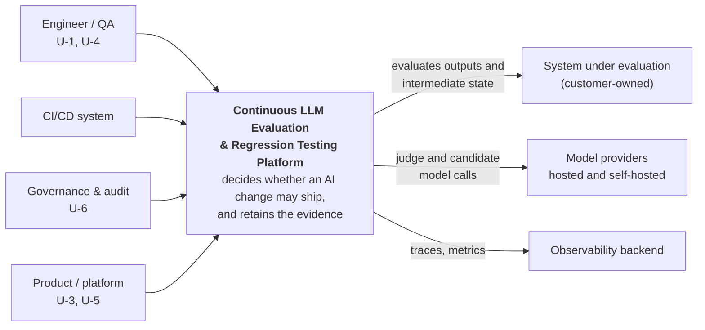
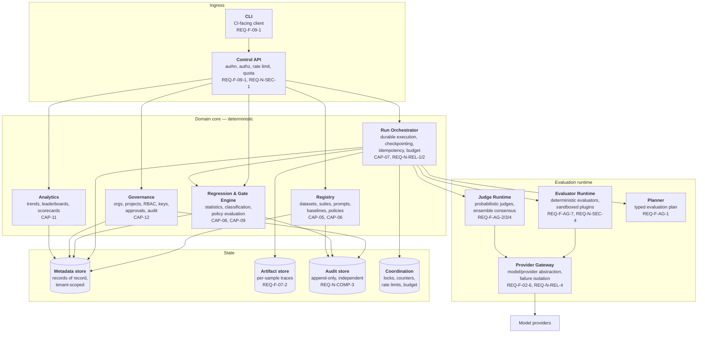
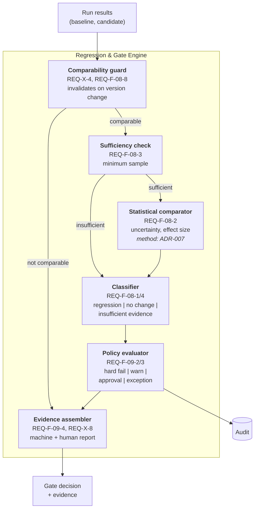
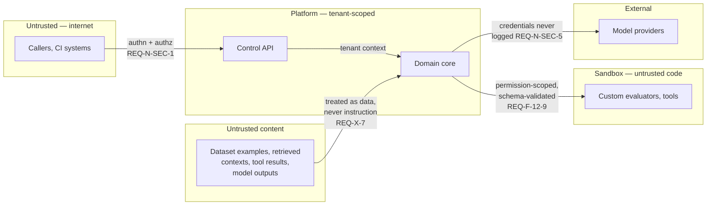

# System Architecture

| Field | Value |
|---|---|
| Status | **Draft — pending external review** |
| Milestone | M2.1 — System Architecture |
| Phase | Phase 2 — Architecture |
| Governing specification | Canonical master specification (immutable; held locally, not distributed in this repository) |
| Required by | Canonical §7 (agentic boundary), §18 (C4 views) |
| Realises | [`../product/requirements.md`](../product/requirements.md) — 150 requirements |
| Technology | **Not decided here.** Every technology choice is owned by an ADR in [`../adr/`](../adr/). This document names logical components only. |

> **Logical, not physical.** Containers below are units of responsibility and deployment, not processes chosen in advance. Where a boundary exists because a requirement forces it, the requirement is cited. Where a boundary is a judgement call, it says so.

---

## 1. Context (C4 level 1)

**The platform never modifies the system under evaluation.** It reads outputs and intermediate state and returns verdicts and recommendations (`REQ-X-6`, `REQ-F-10-3`). This is the single most important property of the context boundary: the platform is an observer and an authority, never an actor on production.

**Integration depth is the caller's choice** and determines what can be evaluated (`REQ-F-03-4`). The platform refuses evaluators whose inputs are absent rather than approximating them.

## 2. Containers (C4 level 2)

| Container | Responsibility | Why it is separate |
|---|---|---|
| Control API | Sole ingress. Authenticates, authorises, rate-limits, quota-checks. | `REQ-N-SEC-1` requires server-side enforcement of every authorization decision; one ingress makes that auditable rather than distributed. |
| CLI | CI-facing client over the same API. | `REQ-F-09-1` requires both. A CLI that bypassed the API would bypass its authorization. |
| Registry | Versioned datasets, suites, prompts, baselines, gate policies, and their approval state. | Immutability and approval are properties of these artifacts (`REQ-F-05-1`, `REQ-F-06-5`), not of the runs that consume them. |
| Run Orchestrator | Owns run identity, durable execution, checkpointing, resumption, idempotency, budget enforcement. | `REQ-N-REL-1/2` and `REQ-F-07-5` require survival of worker loss and exactly-once effects — a distinct concern from scoring. |
| Regression & Gate Engine | Statistical comparison, regression classification, gate policy evaluation, evidence assembly. | The product's centre of gravity (`prd.md` §5.1). Separated so a gate verdict cannot be produced as a side effect of scoring. |
| Evaluator Runtime | Executes deterministic evaluators and sandboxed third-party plugins. | `REQ-N-SEC-4` requires a permission boundary; untrusted plugin code must not share a trust domain with the gate engine. |
| Judge Runtime | Executes probabilistic judges and computes ensemble consensus. | `REQ-F-08-6` requires deterministic and probabilistic results to be structurally separate, not separated by naming. |
| Planner | Produces a typed, human-amendable evaluation plan. | `REQ-F-AG-1`. The only component permitted to reason about *what* to evaluate. |
| Provider Gateway | Single egress to model providers; isolates provider failure. | `REQ-F-02-6` and `REQ-N-REL-4` require per-candidate failure isolation and defined behaviour per failure mode. |
| Governance | Orgs, projects, RBAC, credentials, approvals, audit emission. | `REQ-F-12-8` requires governance at every tier, so it cannot be an optional layer. |
| Analytics | Trends, leaderboards, scorecards, alerts. | Read-mostly, different scaling profile (`REQ-N-PERF-3`), and must never be the source of a gate verdict. |

### State separation

Four stores, separated because their integrity requirements differ rather than for scale:

| Store | Holds | Distinct requirement |
|---|---|---|
| Metadata | Records of record; tenant-scoped rows | `REQ-F-12-5` isolation enforced at the persistence boundary |
| Artifact | Per-sample traces and outputs; large, immutable | `REQ-F-07-2`, `REQ-N-PRIV-4` deletion must reach derived artifacts |
| Audit | Governance events; append-only | `REQ-N-COMP-3` retained independently, not deletable by the actors it records |
| Coordination | Locks, budget counters, rate-limit state; ephemeral | `REQ-X-9` in-flight budget enforcement, `REQ-N-SEC-9` per-tenant limits |

**The audit store is separate because `REQ-N-COMP-3` makes it so.** If audit rows lived alongside tenant data under the same retention and the same delete paths, an actor could erase the record of their own action. Separation is the requirement, not an optimisation.

## 3. Components of the Gate Engine (C4 level 3)

The gate engine is expanded because it carries the product's differentiation and its highest-risk logic.

Three ordering properties are deliberate and load-bearing:

1. **The comparability guard runs first.** A statistically impeccable comparison of two incomparable things is worse than no comparison, because it produces a confident number. `REQ-X-4` requires enforcement, not a warning.
2. **Sufficiency is checked before statistics, and can short-circuit to the classifier.** This is how "insufficient evidence" becomes a first-class outcome (`REQ-F-08-4`) rather than a footnote on a computed verdict.
3. **The evidence assembler is reachable from every terminal path**, including both refusal paths. A refusal must be as explainable as a verdict (`REQ-N-USE-1`).

## 4. Deterministic and reasoning responsibilities

`[CANON §7]` Reasoning is used only where the input is genuinely under-specified. Canonical §7 forbids inflating conventional services into agents, and `PR-1` in the PRD holds the product to it.

| Reasoning component | Why reasoning is justified | Bound |
|---|---|---|
| Planner (`REQ-F-AG-1`) | Turning an objective plus constraints into an evaluation plan is under-specified: many valid plans exist. | Output is a typed plan, human-inspectable and amendable before execution. |
| Judges (`REQ-F-AG-2/3`) | Semantic quality is not computable by rule; canonical §4 is explicit that traditional tests cannot measure it. | Never sole authority. Disagreement, confidence, and version are exposed; low agreement escalates (`REQ-F-AG-4`). |
| Bounded self-critique (`REQ-F-AG-5`) | An invalid or low-confidence plan or judgement can sometimes be repaired by re-examination. | Maximum iterations, budget, timeout, full iteration history. |

**Everything else is conventional software, explicitly:** authentication, authorization, tenancy, persistence, queueing, scheduling, retries, checkpointing, deterministic evaluators, threshold comparison, statistical computation, gate policy evaluation, audit, cost accounting, reporting, analytics.

The boundary rule: **a component may reason only if a human can inspect its output before that output affects a release decision, or if its output is one vote among several.** The planner satisfies the first, judges the second. No component satisfies neither.

Consequence worth stating: **the gate verdict itself is never produced by reasoning.** Judges contribute scores; the classifier and policy evaluator are deterministic. This is what makes a verdict reproducible (`REQ-F-07-3`) and is the architectural expression of positioning pillar P-1.

## 5. Trust boundaries (overview)

Detailed in [`threat-model.md`](threat-model.md); summarised here because they shape the container layout.

Five boundaries, each forced by a requirement:

1. **Internet → platform.** Every request authenticated, every authorization server-side (`REQ-N-SEC-1`).
2. **Tenant → tenant.** Enforced at the persistence boundary, not in application logic (`REQ-F-12-5`); attempts fail and are audited (`REQ-N-SEC-2`).
3. **Platform → untrusted code.** Custom evaluators and tools run permission-scoped and schema-validated (`REQ-F-12-9`, `REQ-N-SEC-4`).
4. **Untrusted content → judges.** Dataset examples, retrieved contexts, tool results, and model outputs are data, never instruction (`REQ-X-7`, `REQ-N-SEC-3`). This boundary is the one most easily lost, because the content arrives through a legitimate path.
5. **Platform → providers.** Sole egress through the Provider Gateway; credentials never persisted in plaintext, logged, or included in reports (`REQ-N-SEC-5`).

## 6. Architectural consequences of specific requirements

Recorded because each constrains later phases in a way that is expensive to discover late.

| Requirement | Consequence |
|---|---|
| `REQ-F-07-1` immutable run identity | Run identity must be captured *before* execution and be content-addressable, or replay (`REQ-F-07-3`) cannot be honest about what it reconstructed. |
| `REQ-F-05-8` erasure with preserved history | Example content and run records must be separable, so content can be destroyed while the record survives in a demoted state. Mechanism decided in ADR-011. |
| `REQ-F-12-5` isolation at persistence | Tenancy cannot be an application-layer filter; a missed predicate would be a silent cross-tenant read. |
| `REQ-N-COMP-3` independent audit | Audit cannot share a delete path or retention policy with tenant data. |
| `REQ-F-08-6` deterministic/probabilistic separation | Two distinct result shapes, separate storage, separate reporting — not a discriminator column. |
| `REQ-X-1` incompleteness propagation | Completeness is a property carried by every aggregate through every layer to every export, not a rendering concern. |
| `REQ-N-OBS-3` vendor-neutral core | Vendor integrations are adapters behind a port; a build excluding all of them must function. |
| `REQ-F-12-8` governance at every tier | Governance cannot be a deployment-time add-on or a licensed module. |

## 7. Deferred to ADRs

| Decision | ADR |
|---|---|
| Durable execution technology | [ADR-001](../adr/ADR-001-durable-execution.md) |
| Reasoning-component orchestration | [ADR-002](../adr/ADR-002-agent-orchestration.md) |
| Model/provider abstraction | [ADR-003](../adr/ADR-003-provider-abstraction.md) |
| Judge ensemble and consensus | [ADR-004](../adr/ADR-004-judge-ensemble.md) |
| Dataset immutability and versioning | [ADR-005](../adr/ADR-005-dataset-immutability.md) |
| Evaluator SDK and plugin isolation | [ADR-006](../adr/ADR-006-evaluator-isolation.md) |
| Regression statistics and gate semantics | [ADR-007](../adr/ADR-007-regression-statistics.md) |
| Tool-integration protocol | [ADR-008](../adr/ADR-008-tool-protocol.md) |
| Observability core and optional adapters | [ADR-009](../adr/ADR-009-observability-core.md) |
| Multi-tenancy isolation mechanism | [ADR-010](../adr/ADR-010-multi-tenancy.md) |
| Artifact retention and reproducibility | [ADR-011](../adr/ADR-011-artifact-retention.md) |

Physical deployment topology, scaling, and infrastructure are Phase 14 `[CANON §23]` and are not specified here.
