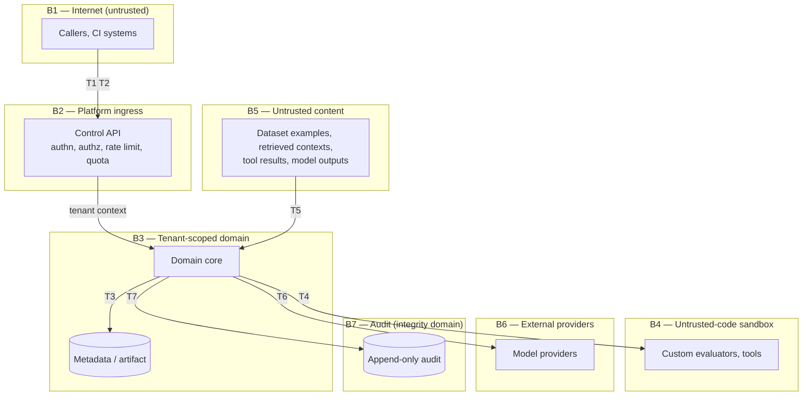

# Threat Model and Security Architecture

| Field | Value |
|---|---|
| Status | **Draft — pending external review.** Revised in Phase 12 against the implementation |
| Milestone | M2.5 — Trust Boundaries, Threat Model, Security Architecture · revised M12.8 |
| Phase | Phase 2 — Architecture · revised in Phase 12 |
| Required by | Canonical §16, §18 (threat model, trust-boundary views), §21 · `REQ-N-SEC-8` |
| Product input | [`../product/prd.md`](../product/prd.md) §7 — data sensitivity classes `DS-1`…`DS-9` |

This threat model consumes the product-level sensitivity taxonomy rather than inventing its own, as the PRD intended.

> **What the Phase 12 revision changed, and what it did not.** `REQ-N-SEC-8` requires a formal threat model *before* production hardening, and `SR-4` recorded that this document was its architectural predecessor rather than its replacement. Phase 12 built the T1, T2, T6 and T7 mitigations, so those rows now describe enforcement that exists and can be pointed at. Nothing in §1 to §3 was rewritten to match what was built — the threats are the same threats, and a threat model edited to agree with an implementation stops being a check on it. §5 is where the change is: two residual risks close, one narrows, and one is added that the implementation itself revealed.

## 1. Assets, by sensitivity class

| Class | Asset | Primary concern |
|---|---|---|
| `DS-1` | Golden dataset content | Confidentiality; may contain personal data. Classification, redaction and per-tenant retention are required by `REQ-F-05-7` |
| `DS-2` | Candidate outputs | Confidentiality by propagation from `DS-1` |
| `DS-3` | Retrieved contexts | **Highest confidentiality** — customer internal documents |
| `DS-4` | Agent trajectories | Confidentiality; tool inputs carry identifiers and credential-adjacent parameters |
| `DS-5` | Judge rationales | Confidentiality by propagation; quotes `DS-1`–`DS-3` verbatim |
| `DS-6` | Prompts | Confidentiality; proprietary business logic |
| `DS-7` | Provider credentials | **Direct financial and data-access exposure** |
| `DS-8` | Cost and usage records | Commercial confidentiality |
| `DS-9` | Audit records | **Integrity**, not confidentiality; must be tamper-evident |

`DS-5` and `DS-9` drive design decisions that would otherwise be missed. Judge rationales are generated text that quotes evaluated content, so every redaction, retention, and deletion obligation on `DS-1`–`DS-3` propagates to them (`REQ-N-PRIV-4`). Audit records invert the usual concern: their threat is modification, not disclosure (`REQ-N-COMP-3`).

## 2. Trust boundaries

## 3. Threats by boundary

Rated by consequence, not by likelihood, because likelihood is unknowable before deployment and rating on a guess would misdirect design effort.

### T1 · B1→B2 — Authentication and authorization bypass

| Threat | Mitigation | Requirement |
|---|---|---|
| Unauthenticated access | Every request authenticated at the sole ingress | `REQ-N-SEC-1` |
| Authorization enforced client-side | Every authorization decision server-side; the CLI is a client of the same API, never a bypass | `REQ-N-SEC-1`, `REQ-F-09-1` |
| Credential replay after compromise | Scoped credentials with rotation and revocation | `REQ-F-12-3` |
| Privilege escalation via role edit | Role and permission changes are audited governed actions | `REQ-F-12-2`, `REQ-X-5` |

**Consequence: critical.** A bypass exposes every class from `DS-1` to `DS-8`.

### T2 · B1→B2 — Resource abuse

| Threat | Mitigation | Requirement |
|---|---|---|
| Cost exhaustion by expensive submissions | Pre-execution estimate; rejection above budget | `REQ-F-10-5`, `REQ-N-COST-3` |
| Denial by request volume | Per-tenant rate limits and quotas | `REQ-N-SEC-9` |
| Cross-tenant throughput starvation | Per-tenant limits; no cross-tenant interference | `REQ-N-SCALE-2` |

**Consequence: high.** Evaluation spends real money at provider APIs, so an abuse path is a direct financial exposure, not only an availability one.

### T3 · B3 — Cross-tenant leakage

| Threat | Mitigation | Requirement |
|---|---|---|
| Missing tenant predicate in a query | Isolation enforced by the datastore, not by query construction | `REQ-F-12-5`, [ADR-010](../adr/ADR-010-multi-tenancy.md) |
| Application principal bypasses isolation | Runtime principal cannot bypass enforcement; distinct from the migration principal | ADR-010 rule 2 |
| Tenant context confusion mid-request | Context established once at ingress, never re-derived from caller input | ADR-010 rule 3 |
| Leakage via analytics aggregation | Analytics operate within tenant scope | `REQ-N-PERF-3`, `REQ-F-12-5` |

**Consequence: critical.** This is the threat the architecture is most explicitly shaped by: the failure is silent, produces no error, and may surface only in an audit.

### T4 · B3→B4 — Untrusted code

| Threat | Mitigation | Requirement |
|---|---|---|
| Evaluator reads data outside its sample | Deny-by-default grants; invocation scoped to one tenant and one sample | `REQ-N-SEC-4`, `REQ-F-12-9` |
| Evaluator exfiltrates via network | No egress without an explicit grant | `REQ-N-SEC-4` |
| Evaluator escapes in-language restriction | Isolation enforced outside the evaluator's process boundary | [ADR-006](../adr/ADR-006-evaluator-isolation.md) rule 4 |
| Evaluator lies about its output shape | Runtime schema validation; mismatch rejects rather than records | `REQ-F-AG-9` |
| Resource exhaustion by evaluator | Timeouts and bounded resources; crash yields unavailable, never a zero | `REQ-X-2` |

**Consequence: critical.** Custom evaluators are code the platform did not write, running against `DS-1`–`DS-5`.

### T5 · B5→B3 — Prompt injection via evaluated content

| Threat | Mitigation | Requirement |
|---|---|---|
| Dataset example instructs the judge to score favourably | Content treated as data, never instruction | `REQ-X-7`, `REQ-N-SEC-3` |
| Retrieved context carries injected instructions | Same, plus quarantine on detection | `REQ-F-03-5`, `REQ-N-SEC-3` |
| Tool result manipulates trajectory evaluation | Tool results untrusted | `REQ-F-04-6` |
| Injection reaches a rendered report | Content escaped in every rendering path | `REQ-X-7` |
| Injected content changes a gate outcome | Verdict produced by deterministic components, never by a judge alone | `REQ-F-08-6`, ADR-004 |

**Consequence: critical, and this is the most under-appreciated boundary.** Content arrives through a completely legitimate path — it is exactly what the platform exists to evaluate — so there is no anomalous access to detect. The architectural mitigation that matters most is structural: because the gate verdict is computed deterministically and judges only contribute votes, a successful injection can distort a score but cannot by itself produce a passing verdict.

`REQ-N-SEC-3` requires this to be *tested* against an adversarial corpus. That corpus does not yet exist, and until it does, injection resistance is a design intention rather than a verified property. Recorded as a Phase 2 risk.

### T6 · B3→B6 — Credential and data exposure to providers

| Threat | Mitigation | Requirement |
|---|---|---|
| `DS-7` credentials in logs, traces, or reports | Never persisted in plaintext, logged, or included in reports | `REQ-N-SEC-5` |
| Credentials in serialised errors | Error serialisation excludes credential material | `REQ-N-SEC-5` |
| Sensitive content sent to an unintended provider | Sole egress through the Provider Gateway; provider identity recorded per call | `REQ-F-02-2` |
| Data in transit interception | Encryption in transit | `REQ-N-SEC-6` |

**Consequence: critical for `DS-7`.** A leaked tenant credential is a direct financial and data-access exposure at a third party, outside the platform's control.

### T7 · B3→B7 — Audit integrity

| Threat | Mitigation | Requirement |
|---|---|---|
| Actor deletes the record of their own action | Audit append-only; not deletable by the actors it records | `REQ-N-COMP-3` |
| Audit removed by tenant retention policy | Independent retention floor; tenant policy subordinate | `REQ-F-12-6`, `REQ-N-COMP-3` |
| Governed action completes unaudited | Audit write failure fails the action | `REQ-X-5`, failure model |
| Audit backdated or reordered | Audit records carry authoritative time | `REQ-F-12-4` |

**Consequence: high.** Audit failure does not leak data; it removes the ability to prove what happened, which is the whole basis of the regulated-enterprise segment.

## 4. Security architecture principles

| # | Principle | Source |
|---|---|---|
| SA-1 | Isolation is structural, not procedural. Enforced where omission is impossible, not where discipline is required. | `REQ-F-12-5`, ADR-010 |
| SA-2 | Untrusted content is data. It never becomes instruction, in any component. | `REQ-X-7` |
| SA-3 | Untrusted code is bounded outside its own process. In-language restriction is not a boundary. | `REQ-N-SEC-4`, ADR-006 |
| SA-4 | The verdict path is deterministic. Reasoning components contribute inputs, never the decision. | `REQ-F-08-6`, ADR-004 |
| SA-5 | Fail closed. A degraded path emits no verdict. | `REQ-N-REL-3`, `REQ-F-09-5` |
| SA-6 | Audit is a separate integrity domain, not a log level. | `REQ-N-COMP-3` |
| SA-7 | Credentials have no representation in any output. | `REQ-N-SEC-5` |
| SA-8 | Security is present from the first record created, not added in a hardening phase. | `PR-9`, canonical §16 |
| SA-9 | Deletion propagates to derived content, including judge rationales. | `REQ-N-PRIV-4`, `DS-5` |

## 5. Residual risks

| # | Risk | Status |
|---|---|---|
| SR-1 | Injection resistance is unverified — the adversarial corpus `REQ-N-SEC-3` requires does not exist. | **Narrowed, not closed.** Phase 8 built the corpus and the structural defence holds against it: for any content, the prompt outside the fence is byte-identical, and the verdict path is deterministic so a distorted score cannot by itself produce a passing gate. What remains open is that resistance is demonstrated against a corpus this project wrote, which is not the same as resistance to an adversary who has read it. |
| SR-2 | Evaluator isolation mechanism not yet selected; only the boundary property is fixed. | **Open, and now half-built.** Phase 12 delivers the deny-by-default grant, the refusal before the plugin runs, the tenant scoping, and the invocation record (ADR-006 rules 1, 3, 5, 6). Rule 4 — enforcement outside the evaluator's process — is **not** delivered and is Phase 14's. A granted evaluator is permitted, not contained. |
| SR-3 | Retention of a content hash after erasure is unresolved and may itself be regulated. | Open; requires legal input, see [ADR-011](../adr/ADR-011-artifact-retention.md). |
| SR-4 | Threat model is pre-implementation. | **Closed.** Revised in Phase 12 against a built T1, T2, T6 and T7. It remains pre-*production*, which is a different claim and is what SR-8 now carries. |
| SR-5 | No dependency inventory exists yet, so `REQ-N-SEC-7` scanning has nothing to scan. | **Closed.** `docs/evidence/phase-12/dependency_scan.py` queries OSV for every declared dependency at its installed version, fails on any advisory, and fails when it cannot reach the source rather than reporting a clean result it did not obtain. Its first execution found eight advisories against the setuptools the build was actually using. |
| SR-6 | Erasure is verified against the platform's own records and not against the object store, which has no adapter (D-3). | **Open.** An erasure reports `completed` on evidence it can observe. Confirmation that the bytes are gone arrives with the adapter, in Phase 14. |
| SR-7 | Authentication failures are counted and not audited, so a sustained credential-guessing campaign leaves no per-attempt trail. | **Open, and deliberate.** Auditing them would let an unauthenticated caller grow the one store `REQ-N-COMP-3` forbids anyone to prune. The counter is the intended signal; wiring it to platform metrics is Phase 13's. |
| SR-8 | The threat model is pre-production. Canonical §16 and `REQ-N-SEC-8` place a formal threat model before production hardening; this is now post-implementation and still pre-deployment. | Open by design until Phase 14 fixes the deployment topology. |

## 6. What Phase 12 built, by threat

Named so that a reviewer can tell an enforced mitigation from an intended one.

| Threat | Now enforced | Still intended |
|---|---|---|
| T1 authn/authz bypass | Credential verified against a stored derivation; tenant proven by where the key resolves; 35 permissions; every route refuses to start without one; refusals audited | — |
| T2 resource abuse | Per-tenant token bucket that fails closed; per-tenant evaluation quota charged once per run, at the API and at the scheduler | Burst shaping, currency-denominated spend ceilings (ADR-021 deferred) |
| T3 cross-tenant leakage | Unchanged, and now reachable only by a verified principal. D-1 closed: a comparison cannot cite another tenant's evaluator version | — |
| T4 untrusted code | Deny-by-default capability grant, refusal before execution, invocation recorded | Out-of-process isolation (SR-2) |
| T5 prompt injection | Unchanged, plus credential redaction on the path into a judge | Adversarial breadth (SR-1) |
| T6 credential exposure | Redaction at the judge prompt and at the rendered report; transport security refused at startup outside a local environment | At-rest encryption, a deployment property (Phase 14) |
| T7 audit integrity | Justification and target digest written; append-only enforced by grant; cursor paging that cannot skip an event | Automatic expiry / scheduled enforcement — the retention policy is defined and the floor is enforced by a database CHECK, and nothing yet expires anything unattended. Owned by Phase 14 (`D-6`) |

## 7. Out of scope, still

Deployment-time controls — network segmentation, secret-manager selection, key rotation mechanics, WAF, DDoS protection — are Phase 14 `[CANON §23]`. Phase 12 was the other half of this line and has been taken; what remains is named here so its absence stays visibly deliberate.
