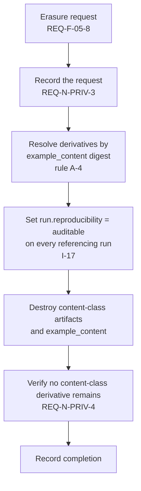

# Artifact Model

| Field | Value |
|---|---|
| Status | **Draft — pending external review** |
| Milestone | M3.3 — Artifact Model |
| Phase | Phase 3 — Data and Contracts |
| Required by | Canonical §9 (per-sample traces and artifacts), §23 |
| Constrained by | [ADR-011](../adr/ADR-011-artifact-retention.md), [ADR-005](../adr/ADR-005-dataset-immutability.md) |

Artifacts are the large, per-sample objects an evaluation produces: inputs as evaluated, raw outputs, judge rationales, and traces. They are separated from the relational model because their integrity, size, and retention behaviour all differ from records.

## 1. Artifact classes

| Class | Contents | Sensitivity | Retention class | Erasable |
|---|---|---|---|---|
| `input_snapshot` | The example content as actually presented, after templating | `DS-1` | content | **Yes** |
| `candidate_output` | Raw generated output | `DS-2` | content | Yes |
| `retrieved_context` | Contexts supplied for RAG evaluation | `DS-3` | content | Yes |
| `trajectory` | Ordered tool calls with arguments and results | `DS-4` | content | Yes |
| `judge_rationale` | Natural-language judge explanation | `DS-5` | content | **Yes** |
| `evaluator_detail` | Per-sample evaluator diagnostic output | `DS-1`–`DS-3` by propagation | content | Yes |
| `gate_evidence` | The assembled evidence behind a gate decision | derived | **audit** | **No** |

**`gate_evidence` is the exception and the reason this table exists.** Every other artifact class is content and erasable. Gate evidence is audit class, because `REQ-N-COMP-1` requires an auditor to reconstruct what evidence supported a past release decision. It must therefore be **derived and self-contained** — carrying the aggregate figures, interval, effect size, classification, and policy and method versions, but *not* embedding erasable content.

If gate evidence embedded raw outputs it would be simultaneously undeletable (audit) and erasable (content), which is not satisfiable. Keeping it self-contained and content-free is what makes `REQ-F-05-8` and `REQ-N-COMP-1` compatible.

## 2. Identity and addressing

| # | Rule | Requirement |
|---|---|---|
| A-1 | Every artifact is addressed by content digest, so identical content stores once and integrity is verifiable. | `REQ-F-07-1` |
| A-2 | Every artifact carries the `organization_id` of its owning tenant. | `REQ-F-12-5` |
| A-3 | Every artifact references the `run_sample` that produced it. | `REQ-X-8` |
| A-4 | Every content-derived artifact references the `example_content` digest it derives from. | ADR-011, `REQ-N-PRIV-4` |
| A-5 | Every artifact carries the correlation identifier of its trace. | `REQ-N-OBS-1` |

**A-4 is the ADR-011 hard constraint on the Phase 3 data model, discharged.** It is what makes erasure bounded work rather than a scan: given a destroyed `example_content` digest, every derivative is reachable by index. Without it, honouring `REQ-N-PRIV-4` would require reading every artifact in the tenant.

**A-1 has a consequence worth stating.** Content addressing means deduplication across runs: two runs evaluating the same example against the same model may produce byte-identical output stored once. Erasure must therefore delete by digest and remove the *reference* from each referencing sample, decrementing rather than assuming a single owner. A naive delete-on-first-reference would destroy an artifact another run still legitimately holds.

## 3. Erasure procedure

Ordered, because the order determines whether the system is ever observably inconsistent.

**Demotion precedes destruction deliberately.** If content were destroyed first, a replay attempted in the interval would find missing content while the run still claimed to be reproducible — the system would be briefly lying. Demoting first means the worst observable intermediate state is a run marked auditable whose content still exists, which is merely conservative.

Audit-class rows, including `gate_evidence`, are untouched throughout (`REQ-N-COMP-3`).

## 4. What artifacts must not contain

| # | Rule | Requirement |
|---|---|---|
| A-6 | No credential material, in any class, including inside serialised errors. | `REQ-N-SEC-5`, `DS-7` |
| A-7 | No cross-tenant content, ever, including in deduplicated storage. Content addressing is scoped per tenant so identical content in two tenants stores twice. | `REQ-F-12-5` |
| A-8 | `gate_evidence` contains no erasable content, only derived figures and version references. | §1 above |

**A-7 forgoes a real storage saving on purpose.** Global deduplication by digest would let one tenant's storage reveal that another holds identical content, and would create a single object whose deletion is governed by two tenants' policies. Per-tenant scoping costs duplication and buys an isolation guarantee that `REQ-F-12-5` requires.

## 5. Deliberately not specified

Object-store technology, layout, compression, encryption-at-rest mechanism, and lifecycle-policy syntax depend on infrastructure that canonical §15 leaves ADR-backed and Phase 14 owns. This milestone specifies classes, identity, references, and procedure only.
