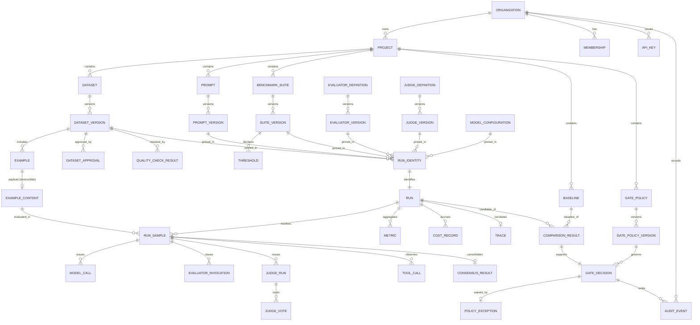

# Data Model, Standards, and Volume Analysis

| Field | Value |
|---|---|
| Status | **Draft — pending external review** |
| Milestone | M3.2 — Data Model |
| Phase | Phase 3 — Data and Contracts |
| Required by | Canonical §18 (ERD, database naming and data-retention standards), §23 |
| Depends on | [`domain-model.md`](domain-model.md) |
| Discharges | `REQ-N-PERF-3` data-volume model · `REQ-N-PERF-4` accounting complexity analysis |

Logical relational design. **No storage engine is named** — canonical §15 leaves that ADR-backed and Phase 3 does not pre-empt it. Every rule below is expressible in any relational store meeting the [ADR-010](../adr/ADR-010-multi-tenancy.md) constraint.

---

## 1. Entity–relationship view

Reduced to the relationships that carry invariants. Attribute-level detail is in [`domain-model.md`](domain-model.md).

**Two relationships are load-bearing and easy to miss.**

`EXAMPLE_CONTENT ||--o{ RUN_SAMPLE` exists so erasure can find every derivative of a destroyed payload without scanning — the ADR-011 constraint on the Phase 3 data model, discharged. `COMPARISON_RESULT ||--|| GATE_DECISION` is one-to-one because a gate decision must reference the exact comparison that produced it (`REQ-F-09-4`); a one-to-many would let a decision cite a comparison it was not derived from.

## 2. Naming standards

Canonical §18 requires database naming standards. These are rules, not preferences, and are mechanically checkable.

| # | Rule | Rationale |
|---|---|---|
| N-1 | Tables `snake_case`, singular (`dataset_version`, not `dataset_versions`). | A row is one thing; singular reads correctly in joins and constraint names. |
| N-2 | Primary key is `id`. | Uniform, so generated joins and tooling need no per-table knowledge. |
| N-3 | Foreign keys are `<referenced_table>_id`. | `dataset_version_id` is unambiguous; `version_id` is not. |
| N-4 | Every tenant-scoped table carries `organization_id`, **not nullable**, even where derivable by join. | ADR-010 rule 1: the store must enforce isolation per access, which requires the column locally rather than through a join chain. |
| N-5 | Content-derived identity columns are named `content_digest`. | Distinguishes verifiable identity from surrogate identity at a glance. |
| N-6 | Timestamps `*_at`, always instant-with-timezone, never local time. | `REQ-F-07-1` requires timestamps in run identity; a local-time timestamp is not reconstructable. |
| N-7 | Boolean columns `is_*` or `has_*`; **state is never boolean where more than two states exist**. | `REQ-X-1`: `completeness` has five values. A boolean would destroy the distinction I-16 exists to preserve. |
| N-8 | Enumerated states are explicit constrained values, never free text. | An unconstrained state column silently admits a sixth completeness value. |
| N-9 | Monetary and token quantities are exact numeric, never floating point. | Cost accounting must reconcile (`REQ-N-COST-1`); binary floating point cannot represent decimal money exactly. |
| N-10 | Index names `ix_<table>__<columns>`; unique `uq_`; foreign key `fk_`; check `ck_`. | Predictable, and collision-free across tables. |
| N-11 | No column named `data`, `info`, `metadata`, or `value` without a qualifier. | Unqualified names accumulate unrelated meanings. |
| N-12 | Audit tables are prefixed `audit_` and live in a separate logical grouping. | ADR-011: audit is a distinct integrity domain, and the naming makes a cross-domain write visible in review. |

## 3. Tenancy enforcement rules

Discharging ADR-010 at the physical level.

| # | Rule | Requirement |
|---|---|---|
| P-1 | Every tenant-scoped table has non-nullable `organization_id`. | `REQ-F-12-5` |
| P-2 | Isolation is enforced by a store-level access policy on every tenant-scoped table, evaluated per statement — not by application predicates. | `REQ-F-12-5`, ADR-010 rule 1 |
| P-3 | The runtime principal cannot bypass those policies. Schema migration uses a distinct principal. | ADR-010 rule 2 |
| P-4 | Global tables are an enumerated exception: `user`, `role`, `provider`, `model`, and global evaluator and judge definitions. Any addition is a reviewable change. | ADR-010 rule 4 |
| P-5 | Every foreign key between tenant-scoped tables is constrained so both sides share the same `organization_id`. | `REQ-F-12-5` |
| P-6 | Cross-tenant access attempts are rejected by the store and emit an audit event. | `REQ-N-SEC-2` |
| P-7 | Negative isolation tests exist per tenant-scoped table, asserting both denial and audit emission. | ADR-010 rule 6 |

**P-5 closes a gap that P-1 and P-2 alone leave open.** Per-table policies stop a cross-tenant *read*; without a same-tenant constraint on foreign keys, a write could still link one tenant's row to another's and create a record that no single-table policy rejects.

## 4. Retention standards

Canonical §18 requires data-retention standards. Three classes, per [ADR-011](../adr/ADR-011-artifact-retention.md).

| Class | Tables | Retention | Deletable by tenant policy | Deletable by erasure request |
|---|---|---|---|---|
| **Audit** | `audit_event`, approvals, `gate_decision`, `policy_exception` | Independent floor | **No** | **No** |
| **Decision** | `run`, `run_identity`, `run_sample`, `metric`, `cost_record`, `comparison_result`, dataset and suite version records, `example` | Tenant policy, floored by audit | Yes, above the floor | No |
| **Content** | `example_content`, `trace`, `model_call`, `tool_call`, `evaluator_invocation`, `judge_vote` rationale payloads | Tenant policy | Yes | **Yes** |

| # | Rule | Requirement |
|---|---|---|
| R-1 | Tenant retention policy cannot lower the audit floor. | `REQ-F-12-6` subordinate to `REQ-N-COMP-3` |
| R-2 | Erasure destroys content-class rows for the targeted `example_content` and every derivative, then sets `run.reproducibility = 'auditable'` on referencing runs. | `REQ-F-05-8`, `REQ-N-PRIV-4` |
| R-3 | Erasure is itself an audited action. | `REQ-N-PRIV-3` |
| R-4 | Deleting a decision-class row referenced by an audit-class row is rejected. | `REQ-N-COMP-1` |
| R-5 | Judge rationales are content class, not decision class. | `DS-5` propagation |
| R-6 | Retention period values are policy inputs and are **not set here**. | Deliberate; see below |

**R-5 is the rule most likely to be got wrong.** A judge rationale reads like system output, so it is natural to file it with decision data. It quotes `DS-1`–`DS-3` verbatim, so classifying it as decision-class would make it survive an erasure request and silently defeat `REQ-N-PRIV-4`.

## 5. Data-volume model — discharging `REQ-N-PERF-3`

`REQ-N-PERF-3` was recorded with `TARGET NOT YET SET` pending "a data-volume model, owned by Phase 3". The model is expressed as **growth relationships**, not absolute figures: no measurement exists, so any absolute number would be invented, while the relationships are derivable from the design and are what capacity reasoning actually needs.

Let `D` = examples in a dataset version, `C` = candidates per run, `E` = evaluators per suite, `J` = judges per ensemble, `R` = runs retained. `REQ-N-SCALE-1` requires `D` to scale well beyond a hand-curated set without redesign, which is why every relationship below is expressed in terms of `D` rather than assuming it is small.

| Table | Rows per run | Growth over history |
|---|---|---|
| `run` | 1 | `R` |
| `run_sample` | `D · C` | `R · D · C` |
| `model_call` | ≈ `D · C · (1 + J)` | `R · D · C · (1 + J)` |
| `evaluator_invocation` | `D · C · E` | `R · D · C · E` |
| `judge_vote` | `D · C · J` | `R · D · C · J` |
| `cost_record` | `D · C · (E + J)` | `R · D · C · (E + J)` |
| `metric` | ≈ `C · E` | `R · C · E` |
| `comparison_result` | ≤ `C` | `R · C` |
| `gate_decision` | ≤ 1 | ≤ `R` |

**Three consequences that constrain design rather than merely describe it.**

1. **The dominant tables are per-sample-per-candidate-per-evaluator**, not per-run. `cost_record` and `judge_vote` grow as the product of five factors. They are the tables that decide whether the system scales, and they are content-class or decision-class detail rather than the records users query most.
2. **Analytics must not scan detail tables.** `REQ-F-11-1` trend queries and `REQ-F-11-3` latency distributions are asked over `R`, while detail rows grow as `R · D · C · (E + J)`. Aggregates must be materialised at run completion, when the data is already in hand, rather than computed on read.
3. **Retention pressure is concentrated in content class.** That is fortunate and not accidental: the class with the steepest growth is also the class erasure and tenant retention may delete, so `REQ-N-PERF-3` responsiveness and `REQ-N-PRIV-4` deletion pull in the same direction.

`REQ-N-PERF-3`'s target remains unset. What Phase 3 supplies is the parameterisation that makes a target measurable — a query latency target is meaningless without stating at which `R · D · C` it holds.

## 6. Cost accounting complexity — discharging `REQ-N-PERF-4`

`REQ-N-PERF-4` requires that answering a per-run cost question not require recomputation over history, with "analysis recorded at Phase 3".

**Analysis.** A naive design stores only `cost_record` rows and sums on demand. Answering "what did run *r* cost" is then `O(D · C · (E + J))` for that run — acceptable. But `REQ-F-07-6` also requires attribution per **project and tenant**, and those queries become `O(R · D · C · (E + J))`: a full scan of the largest table in the system, growing without bound.

**Design consequence.** Cost is aggregated at three levels, each written when the underlying scope closes:

| Level | Written when | Answers in |
|---|---|---|
| `cost_record` | Per call | `O(1)` for one call |
| `run` cost totals | Run reaches a terminal state | `O(1)` per run |
| Project and tenant periodic rollups | Period closes | `O(1)` per period |

Rollups are derived, never authoritative: `cost_record` remains the source of truth so `REQ-N-COST-1` reconciliation against provider-reported usage stays possible. A rollup that disagrees with its detail is a detectable defect rather than a silent one.

**Why this is recorded now rather than at implementation.** Retro-fitting run-level totals is straightforward; retro-fitting them *correctly* for runs whose content-class rows have since been erased is not, because the detail needed to compute them may no longer exist. The aggregate must be written while the data is present.

## 7. Deliberately not specified

Physical types, index selection, partitioning strategy, and constraint syntax depend on the storage engine, which canonical §15 leaves ADR-backed and which Phase 3 does not decide. Migrations are implementation and belong to Phase 4 onward `[CANON §23]`. No DDL is emitted by this milestone.
