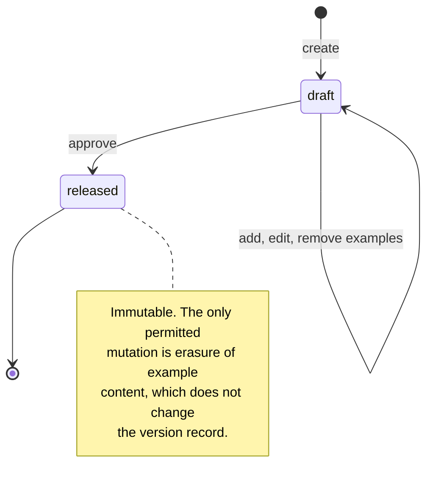

# Dataset and Registry Lifecycle

| Field | Value |
|---|---|
| Status | **Draft — pending external review** |
| Milestone | M4.2 / M4.3 |
| Phase | Phase 4 — Golden Dataset & Benchmark Registry foundation |
| Schema | [`schema/`](schema/) — states and their consistency rules are constraints, not prose |
| Constrained by | [ADR-005](../adr/ADR-005-dataset-immutability.md), [ADR-012](../adr/ADR-012-primary-datastore.md), [ADR-013](../adr/ADR-013-artifact-store.md) |

Only the transition rules and preconditions the schema cannot express. States, their permitted values, and their internal consistency are already enforced by check constraints; repeating them here would create a second source of truth.

## 1. Dataset version

| Transition | Preconditions | Requirement |
|---|---|---|
| → `draft` | Schema reference resolves; every example validates against it | `REQ-F-05-3` |
| `draft` → `draft` | Version is not released | `REQ-F-05-1` |
| `draft` → `released` | Quality checks have run **and** no finding has severity `blocking`; a `dataset_approval` row exists naming the exact `content_digest` being released | `REQ-F-05-5`, `REQ-F-05-6` |
| `released` → anything | **No transition exists.** A change produces a new version | `REQ-F-05-1`, I-6 |

**Quality checks precede approval, not the reverse.** A human reviewer should not be the first line of defence against a duplicate or a leaked test example, and an approval granted before checks ran would be an approval of something not yet examined.

**Approval names the digest.** Recording `target_content_digest` on the approval means an approval cannot be silently transferred to different content — a draft edited after approval but before release would no longer match.

## 2. Example content erasure

The state machine lives on `erasure_request`. The ordering below is the part that matters and is enforced by the state sequence:

| Order | Step | Why this order |
|---|---|---|
| 1 | Record the request and its audit event | `REQ-N-PRIV-3`: the request itself is auditable, before anything is destroyed |
| 2 | Resolve derivatives by `source_content_digest` | Indexed, not a scan — the ADR-011 constraint discharged |
| 3 | **Demote** referencing runs to `auditable` | Before destruction, so the system never claims reproducibility it has already lost |
| 4 | Destroy content-class artifacts and null `payload_ref` | Audit-class artifacts are untouched |
| 5 | Verify no content-class derivative remains | `ck_erasure_request__verified_on_completion` refuses `completed` unless every target is verified |
| 6 | Record completion | |

**Step 3 before step 4 is the rule most easily got wrong.** Destroying first leaves a window in which a run advertises `reproducible` while its inputs are gone. Demoting first means the worst intermediate state is a run marked `auditable` whose content still exists, which is merely conservative.

**Step 5 is why erasure is not an object-store lifecycle rule.** A lifecycle policy has no completion signal and no per-object confirmation, so it cannot support telling a data subject their content was removed.

## 3. Suite version

| Transition | Preconditions | Requirement |
|---|---|---|
| → created | Owner recorded on suite and version | `REQ-F-06-2` |
| Member and evaluator binding changes | `is_frozen` is false | `REQ-F-06-5`, I-12 |
| → frozen | An approved baseline pins this version | I-12 |
| frozen → unfrozen | **No transition exists.** Unfreezing would retroactively change what a past run measured | `REQ-X-4` |

## 4. Suite sharing

A `suite_grant` is an audited, explicit share to another **project within the same tenant**. There is no transition that shares across tenants, and no column in which another tenant's identifier could be placed — cross-tenant sharing is unrepresentable rather than merely rejected (I-13).

Default is project-scoped. The failure mode of over-sharing is silent: a suite carrying another team's thresholds produces confident, wrong gate outcomes.

## 5. What enforces what

Recorded so a reviewer knows where to look, and so nothing is asserted here that the schema does not actually carry.

| Rule | Enforced by |
|---|---|
| State values are legal | Check constraints |
| Released version has a release time | `ck_dataset_version__released_at_matches_state` |
| Erased content has no payload and names its audit record | `ck_example_content__erasure_consistent`, `ck_example_content__erasure_audited` |
| Gate evidence is never erasable and holds no source content | `ck_artifact__gate_evidence_not_erasable` |
| Content-class artifacts name their source | `ck_artifact__content_classes_name_their_source` |
| Erasure completes only when verified | `ck_erasure_request__verified_on_completion` |
| Approval exists and names a digest | `dataset_approval`, unique per version |
| Frozen suite versions carry a freeze time | `ck_suite_version__frozen_at_matches_flag` |
| Cross-tenant links rejected | Composite foreign keys carrying `organization_id` |
| Cross-tenant reads and writes rejected | Row-level security with `FORCE`, `USING` **and** `WITH CHECK` |
| Audit not removable by its subject | `UPDATE` and `DELETE` never granted to the runtime role |

**Ordering preconditions — quality checks before approval, demotion before destruction — are the two rules a constraint cannot express**, because both are statements about sequence rather than about a row. They are the reason this document exists, and they are the first things an implementation review should look for.
